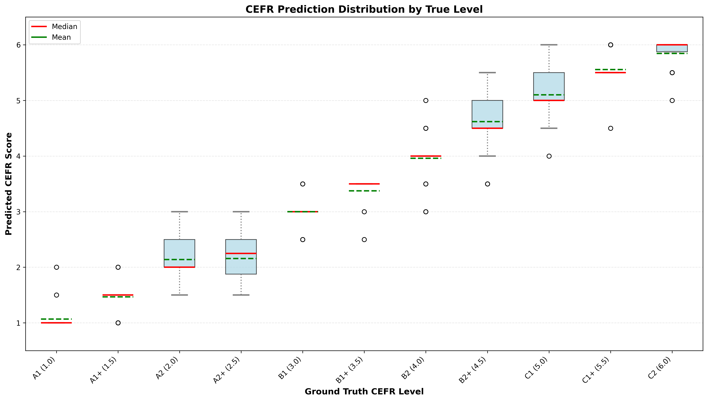

## Level Description:
1.0 (A1), 1.5 (A1+), 2.0 (A2), 2.5 (A2+)

3.0 (B1), 3.5 (B1+), 4.0 (B2), 4.5 (B2+)

5.0 (C1), 5.5 (C1+), 6.0 (C2)

## Metrics:
MSE (Mean Squared Error) - 

RMSE (Root Mean Squared Error) -

MAE (Mean Absolute Error) - 

R² (R-squared) - 

Box plot 

## Requirement

pip install pandas numpy matplotlib scikit-learn


## How to use?

```bash
python evaluate.py predictions.csv groundtruth.csv \
    --pred_col score \
    --gt_col label
```

`score` is your result column name in your `predictions.csv` file.

If you don't understand how those files should be organized, I offer some demo files for your understanding.

```bash
python evaluate.py predictions.csv groundtruth.csv \
    --pred_col score \
    --gt_col score
```

If you still have trouble, contact me via: [yiheng.wu@helsinki.fi](mailto:yiheng.wu@helsinki.fi)